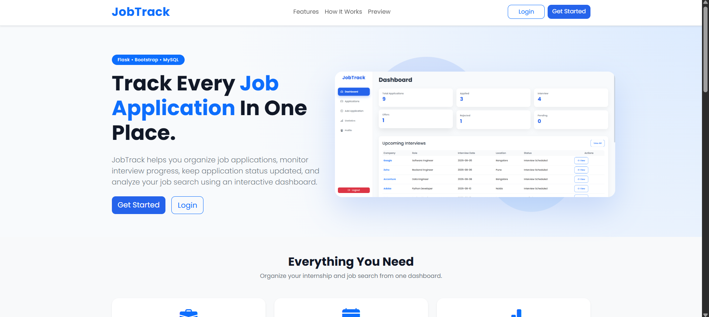
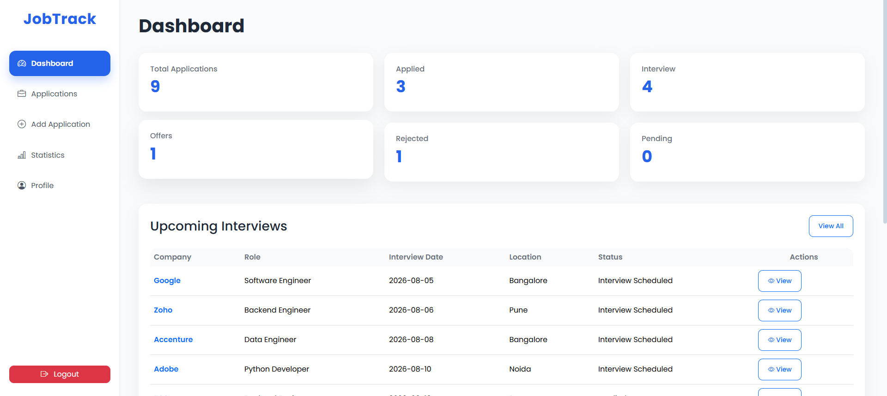
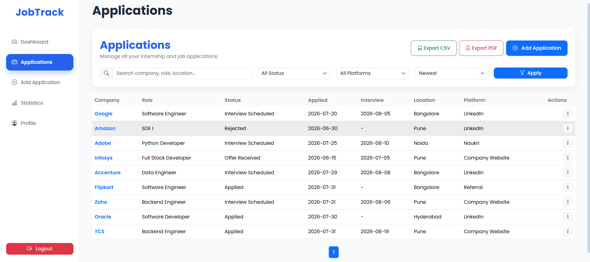
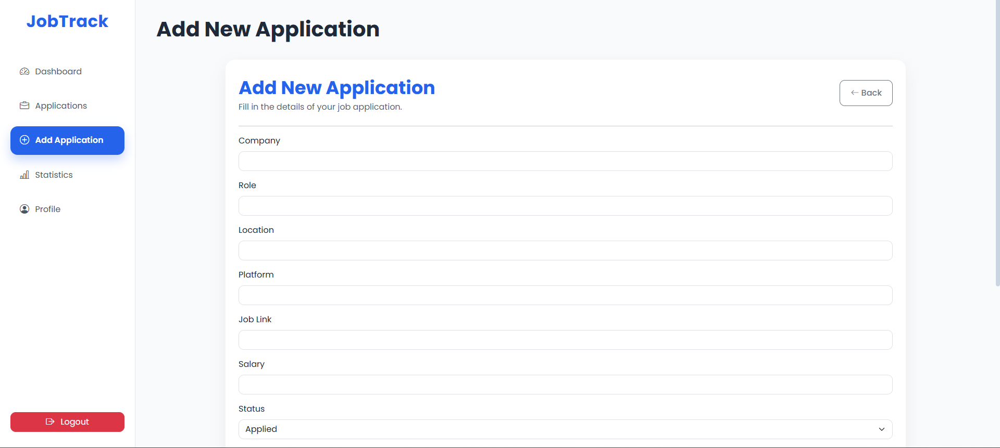
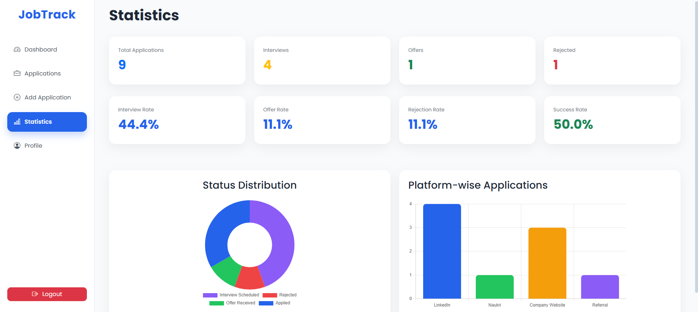

# 💼 JobTrack - Job Application Tracker

<p align="center">
  
</p>

<p align="center">
  
  
  
  
  
  
</p>

A modern **Flask-based Job Application Tracker** that helps job seekers organize, manage, and monitor their job applications from one place.

The application provides authentication, resume uploads, application tracking, statistics, CSV/PDF export, search, filtering, and a clean dashboard.

---

# 🌐 Live Demo

> **Coming Soon (Render Deployment)**

---

# ✨ Features

## 👤 User Authentication

- User Registration
- Secure Login & Logout
- Password Hashing
- Session Management
- Protected Routes

---

## 💼 Job Application Management

- Add Job Applications
- Edit Applications
- Delete Applications
- Search by Company
- Search by Role
- Filter by Status
- View Complete Application History

---

## 📊 Dashboard

- Total Applications
- Applied Jobs
- Interviews
- Offers
- Rejections
- Accepted Jobs
- Success Rate

---

## 📄 Resume Management

- Upload Resume
- Download Resume

---

## 📁 Export

- Export Applications to CSV
- Generate PDF Report

---

## 🔒 Security

- Password Hashing
- Flask-Login Authentication
- Session Protection
- Environment Variables

---

# 🛠 Tech Stack

## Backend

- Python
- Flask
- Flask-Login
- Flask-WTF
- SQLAlchemy 2.0

## Database

- MySQL
- PostgreSQL (Deployment Ready)

## Frontend

- HTML5
- CSS3
- Bootstrap 5
- Jinja2

## Other Libraries

- ReportLab
- Werkzeug
- Gunicorn
- Python-dotenv

---

# 📸 Screenshots

## 🏠 Home Page


---

## 📊 Dashboard



---

## 💼 Applications



---

## ➕ Add Application



---

## 📈 Statistics



---

# ⚙ Installation

## Clone Repository

```bash
git clone https://github.com/harshadx27/JobTrack-Flask.git

cd JobTrack-Flask
```

---

## Create Virtual Environment

```bash
python -m venv .venv
```

---

## Activate Virtual Environment

### Windows

```bash
.venv\Scripts\activate
```

### Linux / macOS

```bash
source .venv/bin/activate
```

---

## Install Dependencies

```bash
pip install -r requirements.txt
```

---

## Environment Variables

Create a `.env` file inside the project root.

```env
SECRET_KEY=your-secret-key

DATABASE_URL=your-database-url

UPLOAD_FOLDER=static/uploads
```

---

## Run Project

```bash
python app.py
```

Open

```
http://127.0.0.1:5000
```

---

# 🚀 Deploy on Render

Build Command

```bash
pip install -r requirements.txt
```

Start Command

```bash
gunicorn app:app
```

Environment Variables

```
SECRET_KEY

DATABASE_URL

UPLOAD_FOLDER
```

---

# 📂 Project Structure

```
JobTrack-Flask/

│

├── app.py

├── models.py

├── forms.py

├── requirements.txt

├── Procfile

├── .env.example

│

├── static/

│   ├── css/

│   ├── images/

│   └── uploads/

│

├── templates/

│

└── instance/
```

---

# 📚 What I Learned

Building this project helped me gain practical experience with:

- Flask Application Development
- SQLAlchemy ORM
- Database Relationships
- Authentication & Authorization
- CRUD Operations
- File Upload Handling
- CSV Export
- PDF Generation
- Session Management
- Environment Variables
- Deployment with Render
- Git & GitHub Workflow

---

# 🔮 Future Improvements

- Email Notifications
- Interview Reminders
- Calendar Integration
- Company Logos
- Dark Mode
- Pagination
- Sorting
- REST API
- Docker Support
- Unit Testing

---

# 👨‍💻 Author

**Harshad Bhadwalkar**

GitHub

https://github.com/harshadx27

LinkedIn

https://www.linkedin.com/in/harshad-bhadwalkar/

---

# ⭐ Support

If you found this project helpful, consider giving it a ⭐ on GitHub.

It motivates me to continue building and sharing more projects.

---

# 📄 License

This project is open-source and developed for learning and portfolio purposes.
